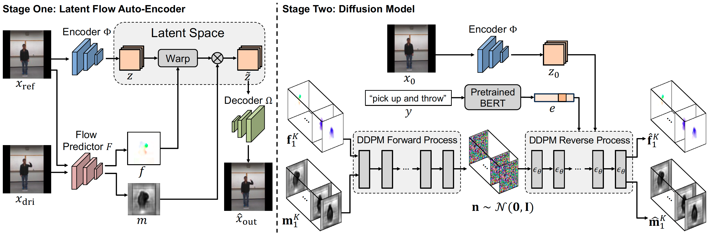
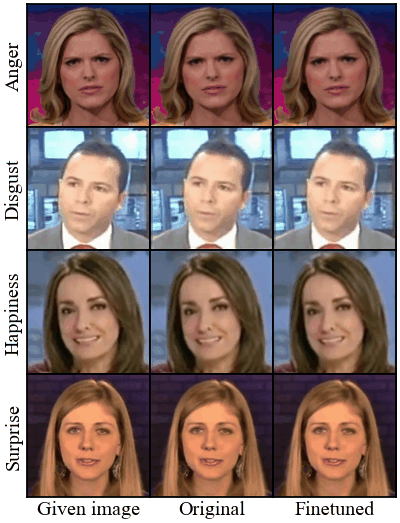

LFDM
=====
The pytorch implementation of our CVPR 2023 paper "Conditional Image-to-Video Generation with Latent Flow Diffusion Models"

This repository is still under development.

Example Videos
------
Some generated video results on MUG dataset.

Some generated video results on MHAD dataset.

Some generated video results on NATOPS dataset.

Applied LFDM trained on MUG to FaceForensics dataset.

Pretrained Models
-----

|Dataset| Model| Link (Google Drive)|
|-------|------|-----|
|MUG|LFAE|https://drive.google.com/file/d/1dRn1wl5TUaZJiiDpIQADt1JJ0_q36MVG/view?usp=share_link|
|MUG|DM|https://drive.google.com/file/d/1lPVIT_cXXeOVogKLhD9fAT4k1Brd_HHn/view?usp=share_link|

